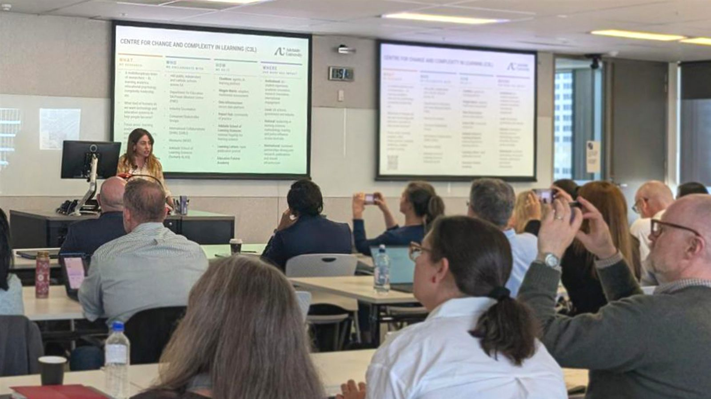

```{=html}
<div class="hero">
  
  <div class="hero-content">
    <p class="hero-eyebrow">C3L &nbsp;·&nbsp; Adelaide University &nbsp;·&nbsp; 2026</p>
    <p class="hero-title-main">The Adelaide School</p>
    <p class="hero-title-sub">of Learning Sciences, Data &amp; AI</p>
    <hr class="hero-rule">
    <p class="hero-tag">Nov 12 &amp; 13 &nbsp;·&nbsp; Twelve sessions &nbsp;·&nbsp; One community built to last</p>
    <p class="hero-free">★ Free Event</p>
    <a class="hero-btn" href="program.html">View Program</a>
    <a class="hero-btn hero-btn-outline" href="https://events.humanitix.com/the-adelaide-school-learning-sciences-data-and-ai" target="_blank" rel="noopener">Register interest</a>
  </div>
</div>

<div class="pillars">
  <div class="pillar">
    <div class="pillar-label">Learn</div>
    <h3>New methods &amp; tools</h3>
    <p>Hands-on sessions across AI tools, statistical modelling, multimodal data, and qualitative methods.</p>
  </div>
  <div class="pillar">
    <div class="pillar-label">Share</div>
    <h3>Your work in progress</h3>
    <p>Bring a slide, a prototype, or a half-formed idea. The Showcase gives everyone a stage.</p>
  </div>
  <div class="pillar">
    <div class="pillar-label">Build</div>
    <h3>Lasting collaborations</h3>
    <p>The Research Clinic and Open Gallery are designed to turn conversations into concrete next steps.</p>
  </div>
</div>

<div class="who-section">
  <div class="who-inner">
    <h2>Who is it for?</h2>
    <ul class="who-list">
      <li><strong>AUGRs &amp; HDRs</strong><span>Methods, AI tools, grant strategy, and collaborations.</span></li>
      <li><strong>ECRs &amp; MCRs</strong><span>Fresh methodological directions and research partnerships.</span></li>
      <li><strong>Practitioners</strong><span>Data-informed learning work across schools, universities, and workplaces.</span></li>
    </ul>
  </div>
</div>

<div class="info-strip">
  <div class="info-item">
    <span class="info-label">When</span>
    <span class="info-val">12–13 November 2026</span>
  </div>
  <div class="info-sep"></div>
  <div class="info-item info-item-venues">
    <span class="info-label">Where</span>
    <span class="info-val info-val-stack">
      <span><em class="info-day">Day 1</em>Pridham Hall · City West</span>
      <span><em class="info-day">Day 2</em>Brookman Hall · City East</span>
    </span>
  </div>
  <div class="info-sep"></div>
  <div class="info-item">
    <span class="info-label">Organisers</span>
    <span class="info-val">C3L</span>
  </div>
  <a class="register-btn" href="https://events.humanitix.com/the-adelaide-school-learning-sciences-data-and-ai" target="_blank" rel="noopener">Register interest</a>
</div>

<div class="grit-section">
  <div class="grit-inner">
    <h2>For AUGRs: build your GRIT hours</h2>
    <p>AUGRs may be able to self-record participation in the Adelaide School as a flexible GRIT activity. A <strong>certificate of attendance</strong> will be issued to all registered participants.</p>
    <p class="grit-note">Students should record their own attendance in GRIT and keep evidence such as registration confirmation, the event program, session details, attendance confirmation, or a certificate of participation. Final approval is subject to Adelaide University's GRIT review process.</p>
  </div>
</div>
```
