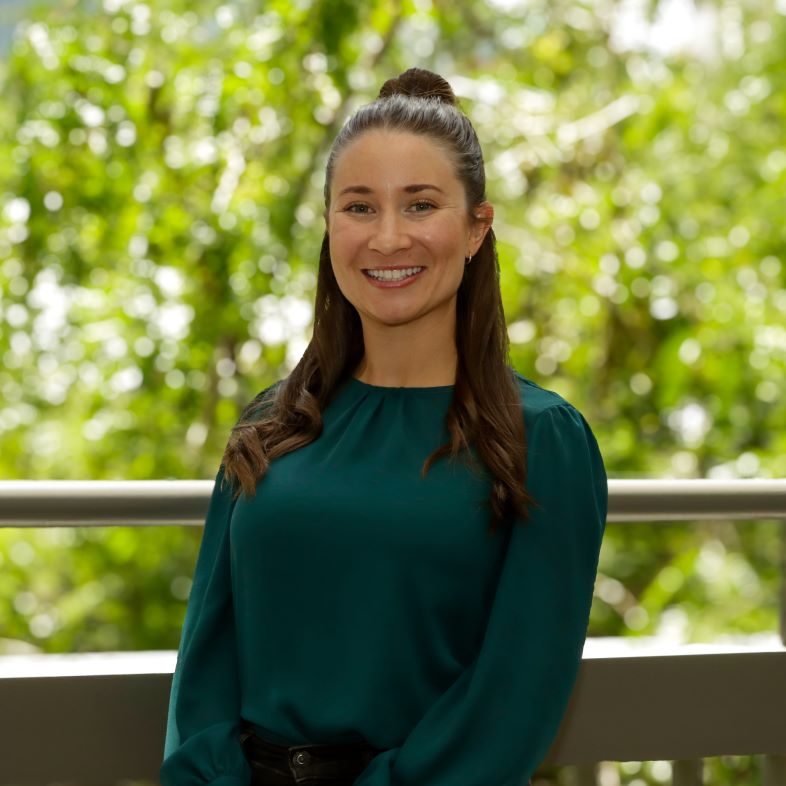
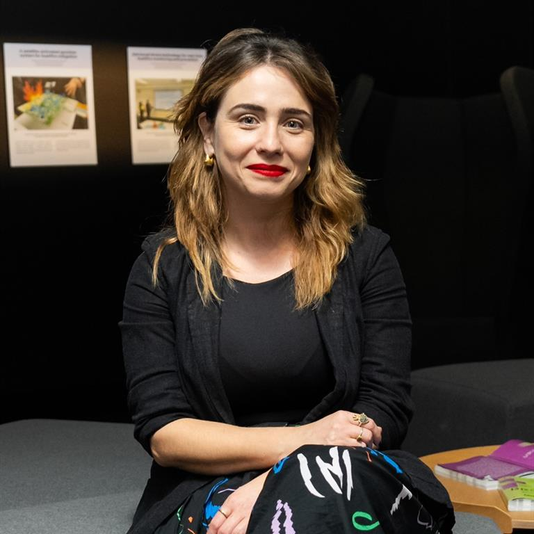
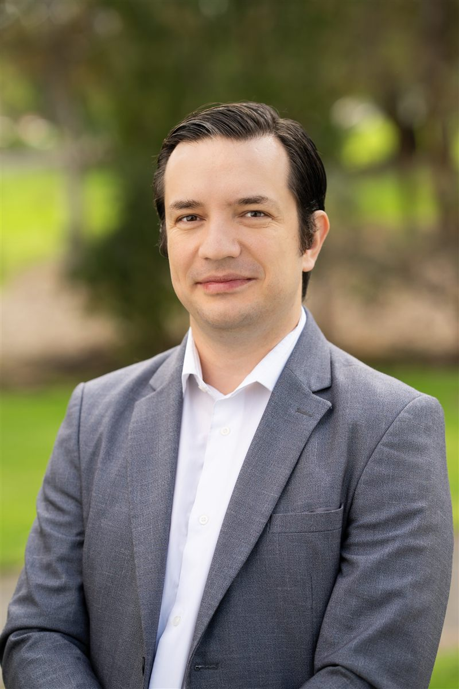
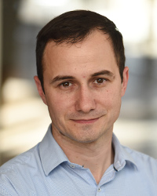

The Adelaide School brings together researchers and practitioners from C3L and partner institutions across Australia and beyond. Sessions are led by people who are actively working on the problems they're presenting — not talking about work they did a decade ago.

::: {.callout-note}
The program is **to be confirmed**. Speakers and sessions are subject to change. Further profiles will be added as the program is finalised.
:::

```{=html}
<div class="speaker-grid">

  <div class="speaker-card" id="daniel-ebbert">
    <div class="speaker-photo-wrap">
      
    </div>
    <div class="speaker-body">
      <div class="speaker-name">Daniel Ebbert</div>
      <div class="speaker-role">Research Fellow, C3L, Adelaide University</div>
      <p class="speaker-bio">Daniel Ebbert is a Research Fellow at Adelaide University's Centre for Change and Complexity in Learning. In his doctoral research, he explored the intersection of self-regulated learning and mind wandering during video-based learning, specifically examining how learners adapt their learning processes after recognising mind wandering episodes. This research aimed to develop evidence-based recommendations for effective responses to mind wandering during learning. Following his PhD, he has begun researching educational technology to support cognitive and metacognitive processes during learning.</p>
      <button class="speaker-more" type="button">Read more +</button>
      <a class="speaker-link" href="sessions.html#build-your-own-ai-research-assistant">Build Your Own AI Research Assistant →</a>
    </div>
  </div>

  <div class="speaker-card" id="oscar-deho">
    <div class="speaker-photo-wrap">
      
    </div>
    <div class="speaker-body">
      <div class="speaker-name">Oscar Blessed Deho</div>
      <div class="speaker-role">Postdoctoral Research Fellow, C3L, Adelaide University</div>
      <p class="speaker-bio">Oscar Blessed Deho is a Postdoctoral Research Fellow at the Centre for Change and Complexity in Learning (C3L), Adelaide University. His research spans ethical AI, learning analytics, and trustworthy data science. He develops fair, explainable predictive models for education, studying how bias emerges and can be mitigated without sacrificing utility. Oscar also investigates the privacy, utility, fairness, and fidelity of synthetic data generation, aiming to enable safe sharing and reuse of sensitive educational and institutional data. His work bridges algorithmic fairness, data governance, and responsible AI to support transparent, equitable, and privacy-preserving decision-making in learning systems and beyond.</p>
      <button class="speaker-more" type="button">Read more +</button>
      <a class="speaker-link" href="sessions.html#designing-your-research-instrument-from-construct-to-question">Designing Your Research Instrument →</a>
    </div>
  </div>

  <div class="speaker-card" id="rebecca-marrone">
    <div class="speaker-photo-wrap">
      
    </div>
    <div class="speaker-body">
      <div class="speaker-name">Rebecca Marrone</div>
      <div class="speaker-role">Senior Lecturer, Learning Sciences, C3L, Adelaide University</div>
      <p class="speaker-bio">Dr Rebecca Marrone is a Senior Lecturer: Learning Sciences and Development for the Centre for Change and Complexity in Learning (C3L) at Adelaide University. She has a background in Educational Psychology, and her research is primarily in the fields of creativity, wellbeing, and human and artificial cognition. More specifically, Rebecca researches the impact of technology on wellbeing with a particular emphasis on how AI impacts teacher and student wellbeing.</p>
      <button class="speaker-more" type="button">Read more +</button>
      <a class="speaker-link" href="sessions.html#leading-in-academia-building-partnerships-with-schools-and-government">Leading in Academia →</a>
    </div>
  </div>

  <div class="speaker-card" id="maria-vieira">
    <div class="speaker-photo-wrap">
      
    </div>
    <div class="speaker-body">
      <div class="speaker-name">Maria Vieira</div>
      <div class="speaker-role">Lecturer, School of Education, Adelaide University</div>
      <p class="speaker-bio">Dr Maria Vieira is a Lecturer in the School of Education at Adelaide University. She holds a PhD in STEM and a Master's degree in the Psychology of Creativity. As a member of the Centre for Change and Complexity in Learning (C3L), her research explores creativity, human–AI collaboration, and gender equity, with a particular focus on STEM fields in which women remain underrepresented. Her research has contributed to both theory and practice through partnerships with schools, industry, and museum spaces.</p>
      <button class="speaker-more" type="button">Read more +</button>
      <a class="speaker-link" href="sessions.html#leading-in-academia-building-partnerships-with-schools-and-government">Leading in Academia →</a>
    </div>
  </div>

  <div class="speaker-card" id="vitomir-kovanovic">
    <div class="speaker-photo-wrap">
      
    </div>
    <div class="speaker-body">
      <div class="speaker-name">Vitomir Kovanovic</div>
      <div class="speaker-role">Professor &amp; Associate Director, C3L, Adelaide University</div>
      <p class="speaker-bio">Professor Vitomir Kovanovic is Associate Director (Research Excellence and Communication) at the Centre for Change and Complexity in Learning (C3L) at the Adelaide University. His research focuses on Learning Analytics and Artificial Intelligence in Education, with the goal of developing new tools and systems to improve student learning. Recently, Prof Kovanovic has been leading the development of the Chatmate platform, an educational AI tool used at Adelaide University and several other schools and universities. He is also the Editor-in-Chief of the Journal of Learning Analytics (JLA) and an Associate Editor at the Higher Education Research &amp; Development (HERD) Journal.</p>
      <button class="speaker-more" type="button">Read more +</button>
      <a class="speaker-link" href="sessions.html#deploy-your-ai-agent-from-prototype-to-practice">Deploy Your AI Agent →</a>
    </div>
  </div>

  <div class="speaker-card" id="andrew-zamecnik">
    <div class="speaker-photo-wrap">
      
    </div>
    <div class="speaker-body">
      <div class="speaker-name">Andrew Zamecnik</div>
      <div class="speaker-role">Early Career Researcher, C3L, Adelaide University</div>
      <p class="speaker-bio">Dr Andrew Zamecnik is an early career researcher at Adelaide University's Centre for Change and Complexity in Learning (C3L). With a PhD in Learning Analytics, his research explores learners' teaming behaviours—such as team cohesion and psychological safety—in collaborative learning contexts. He champions real-time, AI-driven analytics that give instructors dynamic feedback and foster personal and social capabilities. Andrew has partnered with prominent research centres, international academics, and industry leaders, including a Gates Foundation–supported project credentialising lifelong learner achievements. His work spans K-12, higher education, and work-integrated learning, advancing innovative assessment for team behaviour development.</p>
      <button class="speaker-more" type="button">Read more +</button>
      <a class="speaker-link" href="sessions.html#a-working-prototype-for-real-time-surfacing-of-learning-dispositions-in-k-12-collaborative-learning">Real-Time Learning Dispositions in K-12 →</a>
    </div>
  </div>

  <div class="speaker-card" id="phuong-pham">
    <div class="speaker-photo-wrap">
      
    </div>
    <div class="speaker-body">
      <div class="speaker-name">Phuong Pham</div>
      <div class="speaker-role">Graduate Researcher, Adelaide University</div>
      <p class="speaker-bio">Phuong Pham holds a Master of Education from the University of New South Wales and is currently a graduate researcher at Adelaide University. Her PhD research examines how AI and data-driven technologies are reshaping workplace learning, with particular attention to developing a multidimensional scale for measuring AI- and data-mediated workplace learning conditions.</p>
      <button class="speaker-more" type="button">Read more +</button>
      <a class="speaker-link" href="sessions.html#designing-your-research-instrument-from-construct-to-question">Designing Your Research Instrument →</a>
    </div>
  </div>

  <div class="speaker-card" id="ryan-baker">
    <div class="speaker-photo-wrap">
      
    </div>
    <div class="speaker-body">
      <div class="speaker-name">Ryan Baker</div>
      <div class="speaker-role">Professor of AI and Education, Adelaide University</div>
      <p class="speaker-bio">Ryan Baker is Professor of Artificial Intelligence and Education at Adelaide University. He develops AI models that detect student engagement across diverse learning environments and co-developed an observational protocol used by more than 150 researchers in seven countries. His predictive analytics have benefited over two million students, and his MOOCs have reached more than 100,000 learners. Baker founded the International Educational Data Mining Society, serves as Associate Editor of the Journal of Educational Data Mining, and co-directs the JeepyTA learning platform. He also founded two master's programs in Learning Analytics. Baker has co-authored papers with more than 600 collaborators and has been cited over 40,000 times.</p>
      <button class="speaker-more" type="button">Read more +</button>
      <a class="speaker-link" href="sessions.html#coding-qualitative-data-with-ai-faster-smarter-still-rigorous">Coding Qualitative Data with AI →</a>
    </div>
  </div>

  <div class="speaker-card" id="srecko-joksimovic">
    <div class="speaker-photo-wrap">
      
    </div>
    <div class="speaker-body">
      <div class="speaker-name">Srecko Joksimovic</div>
      <div class="speaker-role">Professor &amp; Co-Director, C3L, Adelaide University</div>
      <p class="speaker-bio">Prof Srecko Joksimovic is a researcher in learning analytics, learning sciences, and artificial intelligence in education, and Co-Director of the Centre for Change and Complexity in Learning (C3L) at Adelaide University. His research focuses on the design and use of digital technologies and AI to support learning, collaboration, and human development. His recent work places particular emphasis on metacognition and on understanding how learners monitor, regulate, and reflect on their thinking and learning. He is especially interested in how AI can support these processes through meaningful human-AI interaction, personalised learning, and the analysis of complex learning environments.</p>
      <button class="speaker-more" type="button">Read more +</button>
      <a class="speaker-link" href="sessions.html#evaluating-ai-agents-how-do-you-know-its-working">Evaluating AI Agents →</a>
    </div>
  </div>

</div>

<script>
document.querySelectorAll('.speaker-card').forEach(function (card) {
  var bio = card.querySelector('.speaker-bio');
  var btn = card.querySelector('.speaker-more');
  if (!bio || !btn) return;
  // Hide the toggle when the bio already fits within the clamp
  if (bio.scrollHeight <= bio.clientHeight + 2) { btn.style.display = 'none'; return; }
  btn.addEventListener('click', function () {
    var open = card.classList.toggle('expanded');
    btn.textContent = open ? 'Read less −' : 'Read more +';
  });
});
</script>
```

*Further speaker profiles coming soon.*
